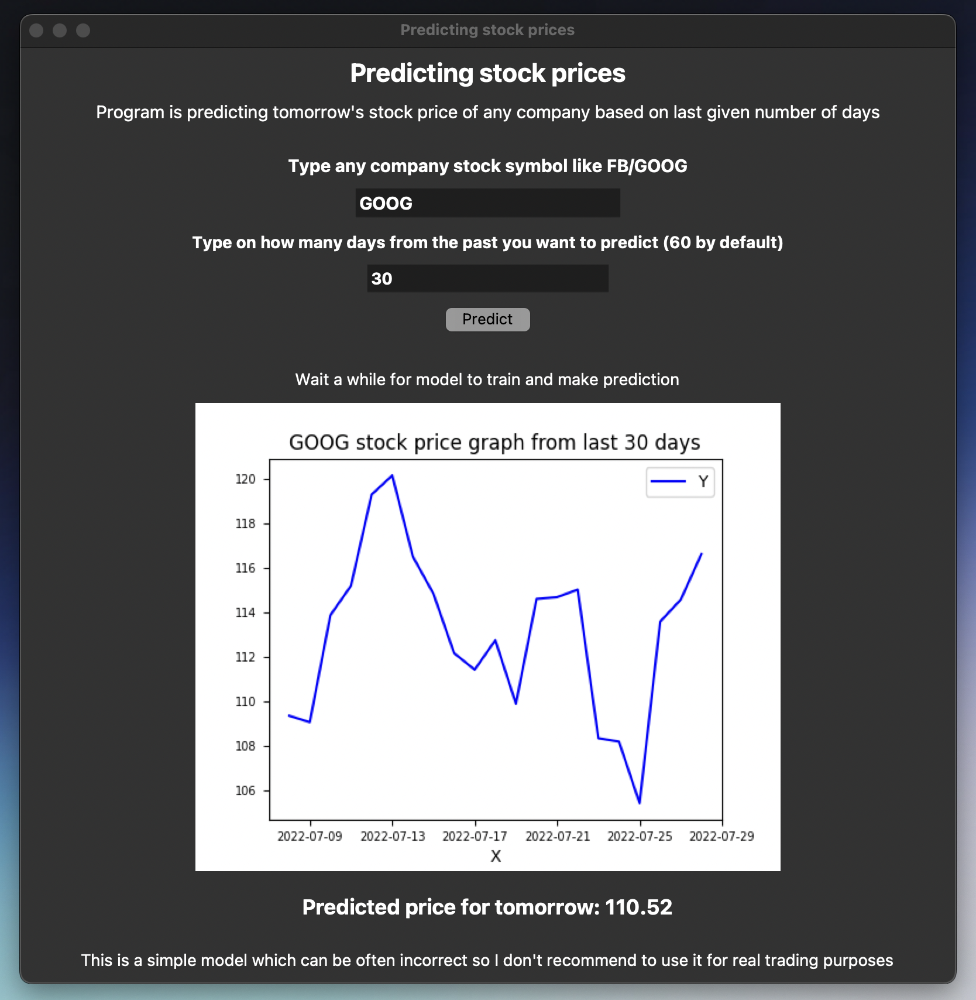

# App to predict stock prices in Python with Machine Learning with GUI made with tkinter 
This app uses simple Machine Learning model to predict tomorrow's stock price of any company based on data from chosen days from the past with nice GUI and graph.

## Technologies Used
- Python 3.9
- Python matplotlib, numpy, pandas, pandas-datareader, tensorflow and scikit-learn modules 

## Screenshots

## Setup
Python 3.x installed and
'pip3 install matplotlib'
'pip3 install numpy'
'pip3 install pandas'
'pip3 install pandas-datareader'
'pip3 install tensorflow'
'pip3 install scikit-learn'

### This is a simple model which can be often incorrect so I don't recommend to use it for real trading pursposes, maybe more like for predicting up or down trend.

## Contact
Feel free to contact me at kontakt.mblaszczykowski@gmail.com
